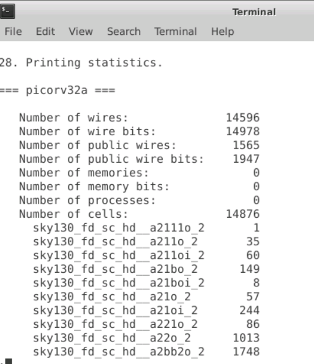
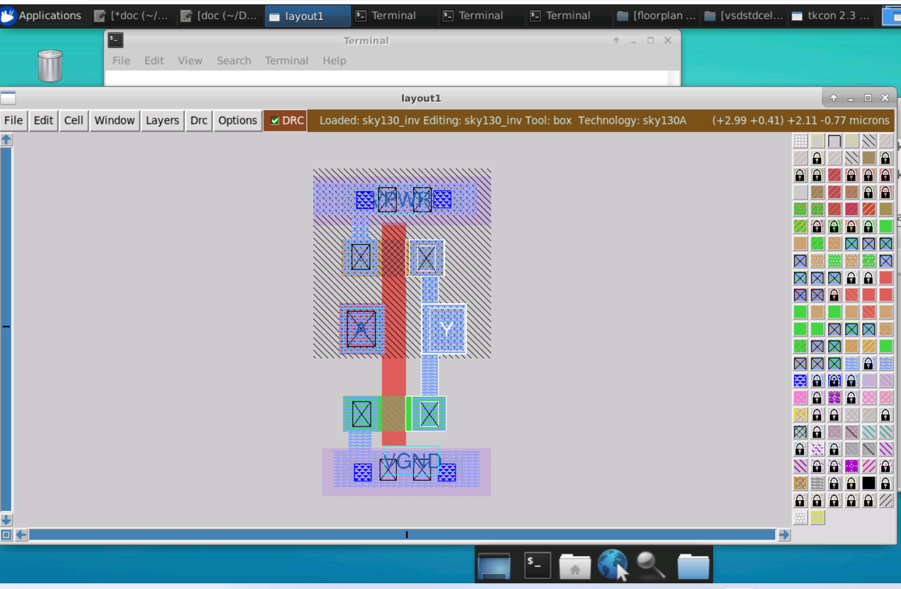

# Advanced-Physical-Design-using-OpenLANE-Sky130
This repository contains the details of steps followed and summary of hands on done on doing the Advanced Physical Design Using OpenLANE/SKY130 workshop. The workshop focuses on complete ASIC Design flow from RTL2GDS using Open Source EDA tool OpenLANE and Google SKYWater130nm pdk. The core of design PICORV32A used is of RISC-V architechture.

  Table of Contents  
  •	Day 1: Inception of open-source EDA, OpenLANE and Sky130 PDK
  •	Day 2: Good Floorplan vs bad Floorplan and Introduction to Library Cells
  •	Day 3 - Design library cell using Magic Layout and ngspice characterization
  •	Day 4 - Pre-layout timing analysis and importance of good clock tree
  •	Day 5 – Final Steps for RTL2GDS using TritonRoute and OpenSTA
     References
     Acknowledgement
     Inquiries

  •	Day 1: Inception of open-source EDA, OpenLANE and Sky130 PDK

o	Talk to Computers 

The below figure shows the Block diagram of a System on a Chip.
 

•	Package contains the semiconductor device. These packages protect the device from damage. They are of various types. An example of QFN-48 (Quad Falt No-Leads) with 48 pins is shown here.
 
  QFN stands for quad flat no-lead package. It is a leadless package that comes in small size and offers moderate heat dissipation in PCBs. Like any other IC package, the function of a QFN package is to connect the silicon die of the IC to the circuit board.
 •	Chip - It sits in the center of the package. The chip is connected to the package pins using wire bond. Inside the chip we have various components such as pad, core, interconnects, etc.
 •	Pads - These are the intermediate structure through which the internal signals from the core of IC is connected to the external pins of the chip. These pads are organized as Pad Frame. There are different kind of pads for input, output, power supply and ground.
 
 
 •	Core - It is the place where all the logic units (gates, muxs, etc) are presnet inside the chip. These are able to execute the set of instructions given to the chip and produce an output.
 •	Die - It is the block which consists of semiconducting material and it can be used to build certain functional cuircuit which can be further sent for fabrication. 

  There is difference between Macros and IPs. There are some files which foundry will give to us. With this, we can communicate with Foundry.
 •	Consider macro cells as pieces of logic blocks, mainly intellectual properties (IP), which can be used in a design without the need to (of) building them from scratch.
 •	Macro-cells in the integrated circuits (IC) design are large blocks which can be viewed as black-boxes. The logic and electronic behavior of these macro-cells are given but the inside structural description may or may not be known.
 •	Standard-cells in the circuit have the same height and need to be placed in the specified rows. Macro-cells may be located anywhere inside the layout area. No overlap is allowed between any two cells (either macro and macro, standard and standard or macro and standard).
 •	An Intellectual Property (IP) core in Semiconductors is a reusable unit of logic or functionality or a cell or a layout design that is normally developed with the idea of licencing to multiple vendor for using as building blocks in different chip designs

From Software Applications to Hardware:

  Compiler which converts high level language to machine language, which reflects in Layout of processor to get output. The Interface required between RISC-V architecture(Specification) and Layout is HDL. RISC-V architecture(Specification) is given to HDL(RTL is to implement specification ) and generates Layout. This is RTL to GDS flow.

 Introduction to RISC V

 •	If the Hardware we have is RISC V CPU core, the Instructions will have the format of RISC V. This task is done by the compiler which converts the incoming high level program to its respective Instructions(contents of .exe file), since the Hardware is implemented using these instructions. The Assembler takes .exe file and converts to Machine language(0&1). This Binary is fed to Hardware(RISC-V Processor) to generate the Output.
 •	RISC V is an instruction set architecture (ISA) rooted in reduced instruction set computer (RISC) principles. RISC-V is unique, even revolutionary, because it is a common, free, open-source ISA to which software can be ported, hardware can be developed, and processors can be built to support it. As a RISC architecture, the RISC-V ISA is a load–store architecture. Its floating-point instructions use IEEE 754 floating-point. 

  •	The functionality of a device written in VHDL or Verilog is RTL. (models a synchronous digital circuit interms of flow of digital signals/data between hardware registers, and the logical operations performed on those signals).
  •	RTL is synthesized to convert to gate-level description called as Netlist.

 SoC Design 

 The 3 important factors in Digital ASIC Design process are,
 1.	RTL Designs(Register Transfer Level) {many RTL design is available in opensource like librecores.org,openecores.org }
 2.	EDA Tools(Electronic Design Automation) {spice simulator, sis, magic, Qflow, openROAD, openLANE etc}
 3.	PDKs Data(Process Design Kits) {Google - Skywater 130nm PDK }

 What is a PDK?
 PDK stands for Process Design Kit, it is provided by foundaries and it consists of library or set of building blocks which are used to build ICs. Each component in the library is seperate building bolck and ae made following certain foundary rules.
 PDKs acts as an inteface between the FABs and the designeers. PDKs have collection of files whcih are used to model a fabrication process for the EDA tools used to design an IC. PDK consists of tecnology node information, Process Design Rules (to verify DRC, LVC, PEX, etc), device model, I/O libraries, Standard cell libraries, macros files, lef files, etc.
 Google along with SKYWater made the laters PDK opensource (130 nm node). 

 Environment Setup
 The OpenLANE flow requires various open source tools as well as their supporting tools to be installed for the complete Physical design flow. Installing this tools one by one is tedious as well as one can get lost in the steps. Installation can be done easily using some set of scripts present in following repositories VSDFlow (for installing Yosys, OpenSTA, Magic, OpenTimer, netgent, etc) and OpenLANE Build Scripts.

 Open Source Digital ASIC Design

 ASIC Design Flow :RTL2GDS Flow

 The flow starts from the HDL code i.e.RTL model and ends with GDSII file. The major implimenation steps are:
 •	Synthesis - During synthesis the HDL design is translated into circuits, which are made up of components present in the standard cell library. The resultant circuit is described in HDL and its referred as gate level netlist which is functional equivalent of RTL code. 

 •	Floor Planning - In Floor planning the die is partitioned into different building blocks or components, also the I/O pads are distributed. 

 •	Power Planning - The power network is constructed typically for a chip was it has to power multiple VDD and ground pins. The power pin are connected to all component through rings and multiple horizontal and vertical strips. Such parallel structure is meant to reduce the resistance.

 •	Placement – Places the cells on the Floorplan rows, aligned with the sites. Placement is done in two ways Global placement and detailed placement. Global placement provide optimal result and these may or may not be legal where as the detail placement is always legal.

 •	Clock Tree Synthesis (CTS) - Before signal routing clock routing is done so that the clock distribution is done to every sequential block. Clock distribution network delivers the clock to each of the sequential block. It is done so that there is minimum skew and latency. It usually follows a shape i.e., H-tree, X-tree, etc.

 •	Routing - The signal routing is done using metal layers. It is essential to find valid pattern of horizontal and verticle wires to implement the nets that connects the cells together. Router uses the available metal layers as defined by the PDK. For each metal layer the PDK defines the thickness, width, pitch and vias. Vias are used to connect two metal wires.

 Getting Familiar to Opensource EDA tools
 EDA or Electronics Design Automation refers to the use of computer programs and software tools for designing, simulation, layout, and verification of electronic systems. These are a set of powerful tools to physically design integrated circuits. As these ASICs are composed of billions of transistors, no human being is capable of designing these circuits without the help of automated tools. These tools assist a chip designer from RTL to GDS level (which is the last step in ASIC design flow before being sent to fabrication). EDA is not only limited to software solutions; it also includes hardware and other services used in the definition, planning, designing, simulating, implementation, verification of the design, and manufacturing of the devices. As integrated circuit technology has grown, the chip design introduces new challenges to optimize in terms of efficiency, power consumption, cost-effectiveness, size, and many more. And there are several different tools available for each step.
  These EDA tools are indispensable to cope with the complexity of very large-scale integrated circuits (VLSI). On the other hand, the cost of these tools is the stumbling block that a small team will never be able to design their chip. 
 For this reason, freeware EDA sources are getting popular among researchers and students to learn about ICs and fabricate their chips.

 OpenLANE Introduction
 OpenLANE is a completely automated RTL to GDSII flow which embeds in it different opensource tools, namely, OpenROAD, Yosys, ABC, Magic etc., apart from many custom methodology scripts for design exploration and optimization. Openlane is built around Skywater 130nm process node and is capable of performing full ASIC implementation steps from RTL all the way down to GDSII. The flow-chart below gives a better picture of openlane flow as a whole (Image Courtesy: efabless/openlane)

 Overview of Physical Design flow
 Place and Route (PnR) is the core of any ASIC implementation and Openlane flow integrates into it several key open source tools which perform each of the respective stages of PnR. Below are the stages and the respective tools (in ( )) that are called by openlane for the functionalities as described:
 •	Synthesis
o	Generating gate-level netlist (yosys).
o	Performing cell mapping (abc).
o	Performing pre-layout STA (OpenSTA).
 •	Floorplanning
o	Defining the core area for the macro as well as the cell sites and the tracks (init_fp).
o	Placing the macro input and output ports (ioplacer).
o	Generating the power distribution network (pdn).
 •	Placement
o	Performing global placement (RePLace).
o	Perfroming detailed placement to legalize the globally placed components (OpenDP).
•	Clock Tree Synthesis (CTS)
o	Synthesizing the clock tree (TritonCTS).
 •	Routing
o	Performing global routing to generate a guide file for the detailed router (FastRoute).
o	Performing detailed routing (TritonRoute)
 •	GDSII Generation
o	Streaming out the final GDSII layout file from the routed def (Magic).

 OpenLane Directory Hierarchy:
 LAB Day1
 Step1:Starting OpenLane
 Go to openlane working directory
 divyadstvm@vsd-pd-workshop-02:~/Desktop/work/tools/openlane_working_dir/openlane$ docker
 bash-4.2$ pwd
 /openLANE_flow
 bash-4.2$ ./flow.tcl -interactive
 % package require openlane 0.9

 •	We use docker command to open the open lane in working directory.
 •	Then use ./flow.tcl -interactive which identifies using the script the flow has to move and intractive means we do a step by step process.
 •	Then we need to import all the package that are required to run this program by package require openlane 0.9
 •	NOTE Command to run fully automated run ./flow.tcl -design picorv32a
 
 Synthesis using OpenLANE:
 Step 2: Design Preperation
 •	Now we would be running our first step which is synthesis in openlane but before that we need to set the file system in the design setup stage which will be setting up the data for our data structure for our design.
 •	For this, enter below command in openlane :
 % prep -design picorv32a 
 When it is done it will show:
 [INFO]: Preparation complete
 •	So after this the runs directory has been created into picorv32a directory under which folder structures required by the openlink will be created in which all the folders will be empty except tmp

 Step 3: Running Synthesis
 For this, enter below command in openlane :
 % run_synthesis
 When it is done it will show:
 [INFO]: Synthesis was successful

 TASK 1 : Finding the d flip flop ratio of the design created
 Flop ratio is defined as the ratio of number of D flip flop to total number of cell.
 Flop Ratio of design  = No: of D-FF / Total No: of cells
 = sky130_fd_sc_hd_dfxt p-2 / No: of Cells  = 1613 / 14876 = 0.1084 = 10.84 %

 Synthesis Report showing No: of D-FF = 1613 

 Synthesis Report showing No: of Cells  = 14876

  •	Day 2: Good Floorplan vs bad Floorplan and Introduction to Library Cells
 The placement of logical blocks, library cells, and pins on a silicon chip is known as chip floorplanning. It ensures that every module has been given the proper area and aspect ratio, that every pin of the module is connected to another module or the chip's edge, and that modules are placed so that they take up the least amount of space on a chip.
 1.	The height and width of core and die
 •	The core, which is located in the middle of the die, is where the logic blocks are placed. The dimensions of each standard cell on the netlist determine the width and height of Core.

 •	Utilization Factor is defined as the ratio of area of occupancy by the netlist to total area of the core. Utilization factor in a realistic situation is between 0.5 and 0.6. Only this space is used for the netlist; the rest space is used for routing and more extra cells.
 •	Aspect Ratio is defined as the ratio between height and the width of core.
 2.	The location of Preplaced Cell
 •	These are complex logic blocks that are previously implemented but can be reused, such as memory, clock-gating cells, muxes, comparator, etc. Prior to placement and routing, the user-defined placement on the core must be completed (thus preplaced cells).
 •	This needs to be very well described because the automated place and route tools won't be able to touch or move these preplaced cells.
 3.	Surround preplaced cells with decoupling capacitors
 •	The complex preplaced logic block needs a lot of current from the power supply to switch the current. However, due to the resistance and inductance of the wire, there will be a voltage drop because of the distance between the main power supply and the logic block. As a result, the voltage at the logic block might no longer fall within the noise margin range (logic is unstable).
 •	Utilizing decoupling capacitors which are hudge bunch of capacitor completely filled with charge, close to the logic block will provide the necessary current for the logic block to switch inside the desired noise margin range.

 4.	Power Planning
 •	It is not possible to apply a decoupling capacitor for sourcing logic blocks with enough current throughout the entire chip, only on the important components (preplaced complex logicblocks).
 •	Due to the large amount of current that must be sinked simultaneously when a large number of elements switch from logic 1 to logic 0, this could result in ground bounce, and switching from logic 0 to logic 1 could result in voltage droop because there is not enough current from the power source to source the needed current for all elements. The increase or decrease in voltage may not be within the noise margin range due to voltage droop and ground bounce.
 •	The reason for problem of voltage droop and ground bounce is because the supply has been provided only from one point so we use multiple power source taps (power mesh) are the solution, allowing components to source current from the closest VDD tap and sink current to the closest VSS tap. The majority of processors include several powersource pins because of this.

 5.	Pin Placement
 •	The area between the core and the die is where the input and output ports are located.
 •	The positions of the ports depend on the placements of the cells that are connected with them on the core.
 •	Since this clock must be able to drive the entire chip so the clock pin is thicker (lowest resistance route) than data ports.

 6.	Logical Cell Placement Blockage
 This ensures that no cells are placed by the automated placement and routing tool on the die's pin locations.

 Floorplanning using OpenLANE
 Steps to run and view Floorplan using OpenLANE
 •	The configuration variables or switches must be set up before to starting the floorplan stage..
 •	The configuration variables location is
 Step 1: Running floorplan
 •	We have lot of switches with which we adjust the flow directory. These switches are used to set certain parameter in each stage of the flow. For eg: In the Floorplanning stage we have FP_CORE_UTIL {for utilization percentage}, FP_ASPECT_RATIO {sets the aspect ratio}, FP_CORE_MARGINS {offset b/w die boundary and core boundary}, etc. We have certain .tcl file in OpenLane which has these switchs that sets these specifications.
 •	The command to run floorplan is:
 % run_floorplan
 Step 2: Review floorplan files and steps to view floorplan
 •	Reviewing files

 TASK 2: Calculating the die area

 Solution of Task:
 DIE AREA(00)(660685  671405)
 Area of Chip = 660.685 / 671.405 = 0.984 um2
 The report showing die area is shown below:

 ioPlacer.log defines the metal layers for the I/Os.
 Step 3: Review floorplan layout in Magic
 •	Using Magic tool to view the def file
 The following command can be used to invoke magic tool as well as to open the def file:
 divyadstvm@vsd-pd-workshop-02:~/Desktop/work/tools/openlane_working_dir/openlane/designs/picorv32a/runs/25-01_17-19/results/floorplan$magic -T /home/divyadstvm/Desktop/work/tools/openlane_working_dir/pdks/sky130A/libs.tech/magic/sky130A.tech lef read ../../tmp/merged.lef def read picorv32a.floorplan.def &
 The generated floorplan layout is shown below:

 To center the view, press "s" to select whole die then press "v" to center the view. Point the cursor to a cell then press "s" to select it, zoom into it by pressing 'z". 
 Zoom in view of floorplan :

 Zoom in view of Standard CellArea:

 tkcon console :
 Type "what" in tkcon to display information of selected object. These objects might be IO pin, decap cell, or well taps as shown below.

 Placement using OpenLANE
 Steps to run and view Placement using OpenLANE
 After floorplanning, next comes placement, it determines location of each of the components on the die. 
 Step 1: Running Placement
 •	The command to run Placement is:
 •	%run_placement

 View the placement in magic
 For visualising the layout following a placement, use the Magic Layout Tool. The following three files are necessary in order to examine a floor layout in Magic
 •	Technology File sky130A.tech
 •	Merged LEF file merged.lef
 •	vim picorv32a.floorplan.def files

 To open layout in magic use this command in this location:
 divyadstvm@vsd-pd-workshop-02:~/Desktop/work/tools/openlane_working_dir/openlane/designs/picorv32a/runs/26-01_19-15/results/placement$ magic -T /home/divyadstvm/Desktop/work/tools/openlane_working_dir/pdks/sky130A/libs.tech/magic/sky130A.tech lef read ../../tmp/merged.lef def read picorv32a.placement.def &
 -T <address_of_sky130A.tech_file> where T is for technology file lef read <address_of_merged.lef_file> to read the lef files (we use lef read because its a standard industry file) def read <address_of_picorv32a.placement.def_file> to read the def files (we use def read because its a standard industry file)

 NOTE
 •	 If address of the required file is at the same working location then we just need to provide the required file name. 
 •	This sky130A.tech(technology), merged.lef(layout exchange format) and picorv32a.placement.def(design exchange format) files comes along with the pdk of sky130.

 The generated floorplan layout is shown below:

 Zoom in view of Placement :

 Zoom in view of Placement :

 Cell Design Flow
 •	In Cell design we will look at how a standard cell is designed in the library
 
 •	Cell height has been defined as the seperation between power and the ground rail and it is the responsibilty of the cell develepor that cell height is mantained. Cell height depends on the timing information(if the cell height is high then it would be able to drive more longer wire, that is called higher drive strength cells)
 •	The standard cells has to operate at a certain Supply Voltage which is being provided by the top level designer and accordingly the library developer has to take that supply voltage and design the library cell such that it specifies supply voltage.
 •	Metal Layer, Pin Locations, Drawn Gate Length requirments has to be decided by the library developer.
Characterization
 •	Next step after we get the extraced step netlist and layout is characterization.
 •	Characterization helps us to get timing, noise and power information.
 •	The output of characterization is timing, noise, power.lib files and the functionality of this circuit.

 Characterization Flow:
 •	Read in the models files
 •	Read the extraced spice netlist
 •	Recognize the behaviour of the buffer
 •	Read the sub circuits of the inverter
 •	Attach the necessary power sources
 •	Apply the stimulus
 •	Provide the necessary output capacitances
 •	Prove the necessary simulation commands
 

  •	Day 3 - Design library cell using Magic Layout and ngspice characterization
 To go in depth of one of the cells(inverter cell), we won't build it from scratch rather we would use the github to get the .mag(magic) files and from there we will be doing Post Layout simulation in ngspice and post characterizing our sample cell, we would be plugging this cell into a OpenLANE flow, into picorv32a core.
 NOTE - In IO placement in floorplan
 On OpenLANE, configurations can be modified while in flight. On OpenLANE, for instance, use % set ::env(FP_IO_MODE) 2 to make IO mode not equidistant. On mode 2, the IO pins won't be evenly spaced out (default of 1). View the def layout for magic by launching floorplan once more with % run floorplan. The configuration will only be available for the current session if it is changed on the fly; it will not be changed in runs/config.tcl, echo $::env(FP_IO_MODE) to output the variable's most recent value.
 SPICE deck creation for CMOS inverter
 First we need to design the library cells:
 •	The CMOS inverter's SPICE deck represents component connections (essentially a netlist).
 •	SPICE deck values equal the W/L value (0.375u/0.25u), which denotes a width of 375nm and a length of 250nm. PMOS should to be 2 or 3 times broader in width than NMOS. Typically, the gate and supply voltages are multiples of length (in the example, gate voltage can be 2.5V)
 •	Place nodes around each component and give it a name. In SPICE, a component can be identified using this.
 SPICE Deck Netlist Description
 
 •	PMOS and NMOS descriptor syntax
 o	[component name] [drain] [gate] [source] [substrate] [transistor type] W=[width] L=[length]
 •	Based on nodes and their values, all components are described.
 SIMULATION COMMANDS
 •	.op .dc Vin 0 2.5 0.05 is the start of SPICE simulation operation where Vin will be sweep from 0 to 2.5 with 0.05 steps
 •	tsmc_025um_model.mod is the model file which contain the technological parameters of the 0.25um NMOS and PMOS Devices.
 Labs for CMOS inverter ngspice simulations
 Steps to simulate in SPICE:
 source [filename].cir
 run
 setplot 
 dc1 
 plot out vs in

 Standard cell design and characterization using openlane flow

 CMOS Inverter Design using Magic

 Magic Tool offers a very user-friendly interface for designing the different layers of the layout. Additionally, it features a built-in DRC check feature.
To Clone vsdstdcelldesign Folder from Github:
 •	This will create "vsdstdcelldesign" directory which contain the sky130_inv.mag and from there we will do post layout simulation.
 •	The technology file which is used as an input is sky130A.tech.
 To Copy sky130A.tech file  to folder vsdstdcelldesign:
 divyadstvm@vsd-pd-workshop-02:~/Desktop/work/tools/openlane_working_dir/openlane/vsdstdcelldesign/
 To invoke .tech and .mag files to open magic:
 divyadstvm@vsd-pd-workshop-02:~/Desktop/work/tools/openlane_working_dir/openlane/vsdstdcelldesign$ magic -T sky130A.tech sky130_inv.mag &
 -T <address_of_sky130A.tech_file> where T is for technology file. Here we use not lef read or def read as in for .def or .lef file because .mag is not a standard industry file). & is use to free the next command prompt.
 •	NOTE If address of the required file is at the same working loaction then we just need to provide the required file name.

 Layout of the CMOS Inveter in magic

 Highlighted Section of CMOS inverter in magic shows as nmos in tkcon:

 To see the connection between 2 parts of a layout, click S thrice. Fig shows o/p,Y connected to Drain of both pmos & nmos.

 Characterizing the cell's(CMOS Inverter) slew rate and propagation delay
 Now to know the logical functioning of the inverte we extrace the spice and do simulation in ngspice open source tool.
 vsdstdcelldesign folder files before extracting ngspice:

 Extracting ngspice :
 Steps to extrace the spice file from magic
 •	Use thie command extract all to create an .ext(extraction) file.
 •	Use this command ext2spice cthresh 0 rthresh 0 then ext2spice to create the .spice file from .ext file, to be used with our ngspice tool and also extrace all the paracitic capacitances.

 SPICE File sky130_inv.spice is created inside Folder vsdstdcelldesign as below:

 sky130_inv.spice file extraced from magic

 We then modify the sky130_inv.spice file as shown below to be able to plot a transient response:
 NOTE To edit vim file in linux press i and make the changes then press Esc and the :wq! to save the changes
 SPICE SIMULATION OF CMOS

 Zoom in view of Plots got after ngspice simulation

 Task3:
 1)	Find CELL FALL TRANSITION
 80% of 3.3v = 2.64v  : x0 = 1.00e-9, y0 =2.65
 20% of 3.3v = 0.66v: x0 = 1.01e-9, y0=0.66
 Cell fall transition = 1.01-1.00=0.01

 2)FIND CELL FALL DELAY
 x0 = 4.07685e-09, y0 =1.65242
 x0 = 4.04954e-09, y0=1.65161
 Cell Fall Delay=4.076 – 4.049 = 0.027

 So now we have characterized our inverter. The next goal is to make a .lef file using this inverter architecture. We will create a unique cell by plugging this .lef into openlane and plugin in this cell into our picorv32a core.

  •	Day 4 - Pre-layout timing analysis and importance of good clock tree
 Delay
 Problem:
 •	The capacitance or the load at the output node of each and every buffer in the complete clock tree is varying.
 •	Also if the load is varying the input transition is varying.

 Timing modelling using delay tables

 Timing Analysis
 First we take the ideal clock (clock tree is not yet build) and do the timing analysis with it. After that we will do with real clock.
 Pre-layout timing analysis (using ideal clock)
 •	SETUP TIMING ANALYSIS. Specifications Clock frequency = 1GHz and period of 1ns.
 We have a launch flop and capture flop and in between we the the combinational logic. We have ideal clock network i.e., clock tree is not yet built. Hence we do not have any buffer in the clock path. This is a typical scenario for hold time and setup time calculation. We send the 1st riseing clock to the launch flop (t=0ns) and the 2nd rising to the capture flop (t=1ns).

 The equation for setup time is:
 Θ < T - S – SU First basic insight is the setup delay should be less than the combinational delay. Then analysing the capture flop we see some delay due to the mux. due to jitter there is delay in the exact point of clock arrival and this variation is due to internal clock circuitary (PLL).
 where.
 •	Θ = Combinational delay which includes clk to Q delay of launch flop and internal propagation delay of all gates between launch and capture flop
 •	T = Time period, also called the required time
 •	S = Setup time. As demonstrated below, signal must settle on the middle (input of Mux 2) before clock tansists to 1 so the delay due to Mux 1 must be considered, this delay is the setup time.
 •	SU = Setup uncertainty due to jitter which is temporary variation of clock period. This is due to non-idealities of PLL/clock source.
 NOTE: Things are different for hold time.
 We have, T = 1000 ps, S = 10 ps, U = 90 ps Hence we arrive at Θ < 0.9 ns (for our case)

